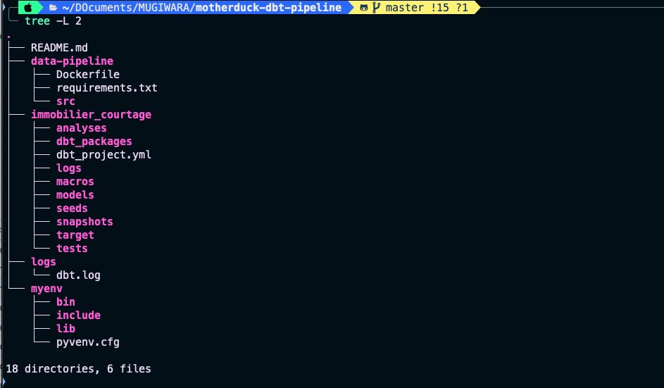

# End-to-End Data Engineering Project

This project demonstrates an end-to-end data engineering pipeline, from data ingestion to analytics and visualization. The pipeline is built using modern tools and follows a medallion architecture approach for data transformation and organization.

## Project Overview

1. **Data Ingestion**: CSV files are ingested from GitHub.
2. **Data Storage**: The ingested files are stored in **MotherDuck** (DuckDB in the cloud).
3. **Data Transformation**: Transformations are applied using **dbt** (Data Build Tool) with a medallion architecture:
   - **Bronze Layer**: Raw data ingestion.
   - **Silver Layer**: Cleaned and enriched data.
   - **Gold Layer**: Aggregated and analytics-ready data.
4. **Data Visualization**: Dashboards and analytics applications are built using **Streamlit**.

---

## Project Structure



### Key Components

- **`data-pipeline/`**: Contains the Python scripts for data ingestion and ETL processes.
- **`immobilier_courtage/`**: Contains the dbt project for data transformation.
- **`myenv/`**: Python virtual environment for managing dependencies.

---

## Tools and Technologies

- **MotherDuck**: Cloud-based DuckDB for data storage.
- **dbt**: Data transformation and modeling.
- **Streamlit**: Dashboard and analytics application.
- **Python**: For ETL and data ingestion scripts.
- **Docker**: For containerizing the pipeline.

---

## Setup Instructions

### Prerequisites

- Python 3.12
- Docker
- dbt CLI
- Streamlit

### Step 1: Clone the Repository

```bash
git clone <repository-url>
cd <repository-folder>
```

### Step 2: Set Up the Python Environment

python -m venv myenv
source myenv/bin/activate  # On Windows: myenv\Scripts\activate
pip install -r [requirements.txt](http://_vscodecontentref_/1)

### Step 3: Configure dbt

- 1. Navigate to the immobilier_courtage/ folder.
- 2. Update the dbt_project.yml file with your MotherDuck connection details.

### Step 4: Run the Pipeline

- 1. Ingest Data: Run the Python ETL script to ingest CSV files from GitHub and load them into MotherDuck.
```bash 
python data-pipeline/src/main.py 
```

- 2. Transform Data: Use dbt to run transformations.

```bash
cd immobilier_courtage/
dbt run
```